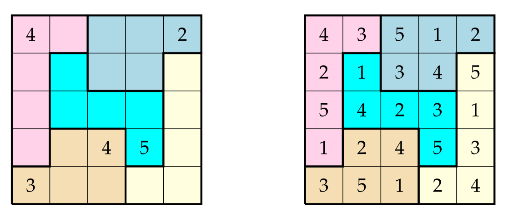

# Chao Sudoku

Formalização do Chaos Sudoku em Lógica Proposicional, utilizando um SAT solver moderno.

## Como funciona o Chaos Sudoku?
É uma variante do Sudoku, seguindo as mesmas restrições do jogo tradicional, porém as regiões a serem preenchidas são irregulares.

